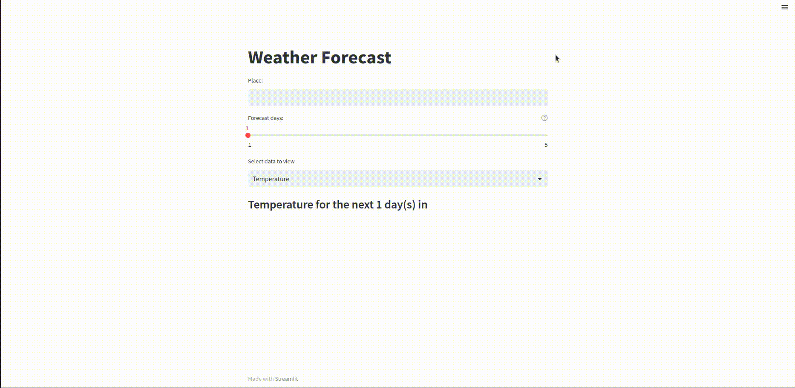

# Weather Forecast
Web data app made with Sreamlit that lets the user know the weather forecast for any city in the world through API calls.

## General Overview
This is an interactive app for weather data visualization. It's made with the <a href="https://openweathermap.org/" target="_blank">OpenWeatherMap API</a> and it plots data dinamically.

#### Requirements
- Python 3
- Streamlit

#### How to use
Clone the repository and install the needed packages. Get your own credentials for the API and use them to replace "xxxx" sections of script. Run from command line with: streamlit run main.py

